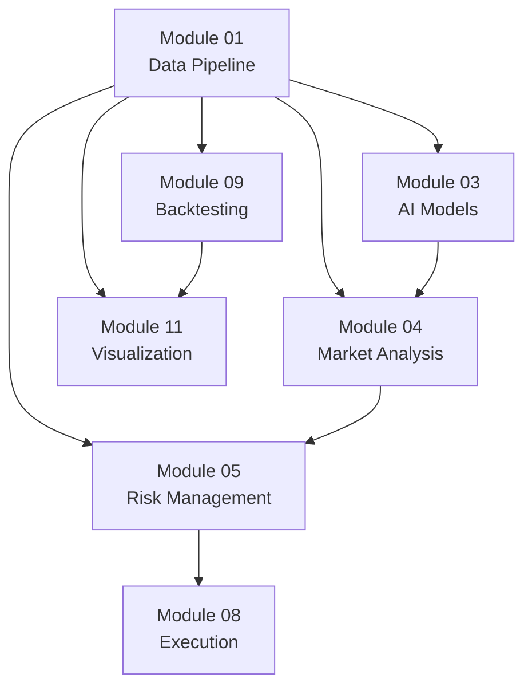

# Module 01 - 数据管道模块

## 概述

数据管道模块是 FinLoom 量化交易系统的核心组件，专门负责中国A股市场金融数据的采集、处理、验证和存储。该模块专注于中国股票市场，提供准确、实时的A股数据服务。

## 主要功能

### 1. 数据采集 (Data Acquisition)
- **AkshareDataCollector**: 专门用于获取中国股票数据，使用akshare库，数据准确性最高
- **ChineseAlternativeDataCollector**: 中国市场综合数据采集（宏观经济、新闻联播、个股新闻、板块数据、每日市场概况、个股详细信息）
- **ChineseFundamentalCollector**: 中国上市公司财务数据采集（财务报表、指标、分红等）

#### 数据采集器特点

**AkshareDataCollector - 中国A股专业数据采集器：**

| 特性 | 描述 |
|------|------|
| 目标市场 | 专门针对中国A股市场 |
| 数据源 | akshare库（专业中国金融数据） |
| 数据准确性 | ⭐⭐⭐⭐⭐ 最高 |
| 交易时间处理 | ✅ 自动处理中国节假日和交易时间 |
| 股票基本信息 | ✅ 丰富的中国股票信息（行业、地区等） |
| 实时数据 | ✅ 中国A股实时行情数据 |
| 宏观数据 | ✅ 中国宏观经济指标（GDP、CPI、PMI） |
| 新闻数据 | ✅ 新闻联播文字稿数据 + 个股新闻 |
| 板块数据 | ✅ 行业板块实时行情 |
| 个股详细信息 | ✅ 综合东财+雪球数据，含公司概况、管理层、联系方式等 |
| 每日市场概况 | ✅ 上交所每日交易概况（支持一年历史数据） |

**使用建议：**
- 🎯 **中国A股投资**: 使用 `AkshareDataCollector` 获取股票数据
- 📊 **基本面分析**: 组合使用 `AkshareDataCollector` + `ChineseFundamentalCollector`
- 📈 **宏观分析**: 使用 `ChineseAlternativeDataCollector` 获取宏观数据
- 📰 **市场情绪**: 使用 `ChineseAlternativeDataCollector` 获取投资者情绪和新闻数据

### 2. 数据处理 (Data Processing)
- **DataCleaner**: 数据清洗和预处理
- **DataValidator**: 数据质量验证
- **DataTransformer**: 数据转换（标准化、归一化、特征工程）

### 3. 存储管理 (Storage Management)
- **DatabaseManager**: 统一数据库管理
- **CacheManager**: 内存缓存管理
- **FileStorageManager**: 文件存储管理

## 快速开始

### 快速开始示例

```python
from module_01_data_pipeline import (
    AkshareDataCollector,           # 中国股票数据采集
    ChineseAlternativeDataCollector, # 中国另类数据采集
    ChineseFundamentalCollector,    # 中国财务数据采集
    DataCleaner,
    get_database_manager
)

# 中国A股数据采集
collector = AkshareDataCollector(rate_limit=0.5)
symbols = ["000001", "600036", "000858"]  # 平安银行、招商银行、五粮液

for symbol in symbols:
    # 获取基本信息
    info = collector.get_stock_basic_info(symbol)
    print(f"{symbol}: {info.get('name')} - {info.get('industry')}")
    
    # 获取历史数据
    data = collector.get_stock_data(symbol, "20240101", "20241231")
    print(f"{symbol}: {len(data)} 条记录")


# 中国宏观经济数据采集
alt_collector = ChineseAlternativeDataCollector()
macro_data = alt_collector.fetch_macro_economic_data()
print(f"宏观数据类型: {list(macro_data.keys())}")

# 显示GDP数据（如果有）
if 'GDP' in macro_data and not macro_data['GDP'].empty:
    gdp_df = macro_data['GDP']
    print(f"GDP数据: {len(gdp_df)} 条记录")
    latest_gdp = gdp_df.iloc[-1]
    print(f"最新GDP数据: {latest_gdp}")

# 获取个股新闻
stock_news = alt_collector.fetch_stock_news("000001", limit=10)
print(f"个股新闻: {len(stock_news)} 条")

# 获取每日市场概况
market_overview = alt_collector.fetch_daily_market_overview()
print(f"市场概况: {len(market_overview)} 条记录")

# 获取个股详细信息
stock_detail = alt_collector.fetch_detail("000001")
print(f"股票名称: {stock_detail.get('name')}")
print(f"公司全称: {stock_detail.get('org_name_cn')}")
print(f"主营业务: {stock_detail.get('main_operation_business', '')[:50]}...")
print(f"法定代表人: {stock_detail.get('legal_representative')}")
print(f"公司电话: {stock_detail.get('telephone')}")
print(f"公司网站: {stock_detail.get('org_website')}")

# 获取一年历史市场数据
print("开始收集一年历史市场数据...")
yearly_overview = alt_collector.fetch_one_year_market_overview()
print(f"一年历史数据: {len(yearly_overview)} 条记录")

# 中国财务数据采集
fund_collector = ChineseFundamentalCollector()
symbol = "000001"

# 获取财务报表
balance_sheet = fund_collector.fetch_financial_statements(symbol, "资产负债表")
income_statement = fund_collector.fetch_financial_statements(symbol, "利润表")
print(f"资产负债表: {len(balance_sheet)} 条, 利润表: {len(income_statement)} 条")

# 获取财务指标
indicators = fund_collector.fetch_financial_indicators(symbol)
print(f"PE: {indicators.get('pe_ratio')}, PB: {indicators.get('pb_ratio')}, ROE: {indicators.get('roe')}")

# 获取分红历史
dividend_data = fund_collector.fetch_dividend_history(symbol)
print(f"分红记录: {len(dividend_data)} 条")

# 数据清洗和存储
cleaner = DataCleaner(fill_method="interpolate")
db_manager = get_database_manager()

for symbol in symbols:
    cleaned_data = cleaner.clean_market_data(data, symbol)
    success = db_manager.save_stock_prices(symbol, cleaned_data)
    print(f"{symbol} 数据存储: {'Success' if success else 'Failed'}")

# 存储宏观数据
if macro_data:
    for indicator, data in macro_data.items():
        success = db_manager.save_macro_data(indicator, data)
        print(f"{indicator} 宏观数据存储: {'Success' if success else 'Failed'}")
```

## API 参考

### AkshareDataCollector

专门用于采集中国股票数据的收集器。

#### 构造函数
```python
AkshareDataCollector(rate_limit: float = 0.1)
```

#### 主要方法

**fetch_stock_list(market: str = "A股") -> pd.DataFrame**
- 获取股票列表
- 支持 A股、港股、美股

**fetch_stock_history(symbol: str, start_date: str, end_date: str, period: str = "daily", adjust: str = "qfq") -> pd.DataFrame**
- 获取股票历史数据
- 自动进行数据标准化

**fetch_realtime_data(symbols: List[str]) -> Dict[str, Dict[str, Any]]**
- 获取实时行情数据
- 支持批量查询

**get_stock_basic_info(symbol: str) -> Dict[str, Any]**
- 获取股票基本信息
- 包括行业、地区等信息

**fetch_financial_data(symbol: str, report_type: str = "资产负债表") -> pd.DataFrame**
- 获取财务数据
- 支持资产负债表、利润表、现金流量表

#### 示例
```python
collector = AkshareDataCollector(rate_limit=0.5)

# 获取股票列表
stock_list = collector.fetch_stock_list("A股")

# 获取历史数据
data = collector.fetch_stock_history("000001", "20240101", "20241231")

# 获取实时数据
realtime = collector.fetch_realtime_data(["000001", "600000"])

# 获取基本信息
info = collector.get_stock_basic_info("000001")
```

### ChineseAlternativeDataCollector

专门用于采集中国市场宏观经济数据、投资者情绪和新闻数据的收集器。

#### 构造函数
```python
ChineseAlternativeDataCollector(rate_limit: float = 0.5)
```

#### 主要方法

**fetch_macro_economic_data(indicator: str = "all") -> Dict[str, pd.DataFrame]**
- 获取宏观经济数据（GDP、CPI、PMI等）
- 支持中国经济指标
- 使用akshare的实际接口获取真实数据
- 支持的指标："GDP", "CPI", "PMI", "all"

**fetch_market_sentiment(symbol: Optional[str] = None) -> Dict[str, Any]**
- 获取市场投资者情绪数据
- 基于实时市场数据进行情绪分析
- 返回看涨/看跌比例和市场情绪指标

**fetch_news_data(date: str = None, limit: int = 50) -> pd.DataFrame**
- 获取新闻联播文字稿数据
- 使用akshare的ak.news_cctv()接口
- 自动添加情绪分析

**fetch_sector_performance(indicator: str = "新浪行业") -> pd.DataFrame**
- 获取板块行情数据
- 使用akshare的ak.stock_sector_spot()接口
- 支持多种板块类型

**fetch_stock_news(symbol: str, limit: int = 50) -> pd.DataFrame**
- 获取个股新闻数据
- 使用akshare的ak.stock_news_em()接口
- 返回指定股票的最新新闻

**fetch_daily_market_overview(date: str = None) -> pd.DataFrame**
- 获取上海证券交易所每日概况
- 使用akshare的ak.stock_sse_deal_daily()接口
- 支持指定日期查询

**fetch_detail(symbol: str) -> Dict[str, Any]**
- 获取个股详细信息（完整版）
- 结合东财和雪球两个API获取全面信息
- 包含50+字段：公司概况、管理层、联系方式、财务信息、发行信息等

**fetch_historical_daily_market_overview(start_date: str, end_date: str) -> pd.DataFrame**
- 获取历史每日市场概况数据
- 支持一年或更长时间范围的数据收集
- 自动跳过周末和节假日

**fetch_one_year_market_overview() -> pd.DataFrame**
- 获取近一年的市场概况数据
- 便捷方法，自动计算日期范围

#### 示例
```python
alt_collector = ChineseAlternativeDataCollector(rate_limit=0.5)

# 获取宏观数据
macro_data = alt_collector.fetch_macro_economic_data()
print(f"数据类型: {list(macro_data.keys())}")

# 显示GDP数据
if 'GDP' in macro_data and not macro_data['GDP'].empty:
    gdp_df = macro_data['GDP']
    print(f"GDP数据: {len(gdp_df)} 条记录")
    latest_gdp = gdp_df.iloc[-1]
    print(f"最新GDP数据: {latest_gdp}")

# 获取投资者情绪
sentiment = alt_collector.fetch_market_sentiment()
print(f"市场情绪: {sentiment['market_sentiment']}")

# 获取新闻数据
news_data = alt_collector.fetch_news_data(date="20241201", limit=20)
print(f"新闻数据: {len(news_data)} 条")

# 获取板块数据
sector_data = alt_collector.fetch_sector_performance()
print(f"板块数据: {len(sector_data)} 个板块")
```
```python
    cpi_df = macro_data['CPI']
    print(f"CPI数据: {len(cpi_df)} 条记录")
    latest_cpi = cpi_df.iloc[-1]
    print(f"最新CPI数据: {latest_cpi}")

# 显示PMI数据
if 'PMI' in macro_data and not macro_data['PMI'].empty:
    pmi_df = macro_data['PMI']
    print(f"PMI数据: {len(pmi_df)} 条记录")
    latest_pmi = pmi_df.iloc[-1]
    print(f"最新PMI数据: {latest_pmi}")
```

### ChineseFundamentalCollector

专门用于采集中国上市公司财务数据的收集器。

#### 构造函数
```python
ChineseFundamentalCollector(rate_limit: float = 0.5)
```

#### 主要方法

**fetch_financial_statements(symbol: str, report_type: str = "资产负债表") -> pd.DataFrame**
- 获取财务报表数据
- 支持“资产负债表”、“利润表”、“现金流量表”

**fetch_financial_indicators(symbol: str) -> Dict[str, Any]**
- 获取主要财务指标
- 包括PE、PB、ROE、ROA等

**fetch_dividend_history(symbol: str) -> pd.DataFrame**
- 获取分红配股历史
- 包括分红比例、收益率等

**fetch_share_structure(symbol: str) -> Dict[str, Any]**
- 获取股本结构信息
- 包括总股本、流通股、限售股

**fetch_major_shareholders(symbol: str) -> pd.DataFrame**
- 获取主要股东信息
- 包括十大股东持股数量和比例

**validate_financial_data(df: pd.DataFrame) -> bool**
- 校验财务数据完整性和合理性

#### 示例
```python
fund_collector = ChineseFundamentalCollector(rate_limit=0.5)
symbol = "000001"  # 平安银行

# 获取财务报表
balance_sheet = fund_collector.fetch_financial_statements(symbol, "资产负债表")
income_statement = fund_collector.fetch_financial_statements(symbol, "利润表")
cash_flow = fund_collector.fetch_financial_statements(symbol, "现金流量表")

print(f"资产负债表: {len(balance_sheet)} 条记录")
print(f"利润表: {len(income_statement)} 条记录")
print(f"现金流量表: {len(cash_flow)} 条记录")

# 获取财务指标
indicators = fund_collector.fetch_financial_indicators(symbol)
print(f"市盈率 (PE): {indicators.get('pe_ratio')}")
print(f"市净率 (PB): {indicators.get('pb_ratio')}")
print(f"净资产收益率 (ROE): {indicators.get('roe')}")
print(f"总资产报酬率 (ROA): {indicators.get('roa')}")
print(f"毛利率: {indicators.get('gross_margin')}")

# 获取分红历史
dividend_data = fund_collector.fetch_dividend_history(symbol)
print(f"分红记录: {len(dividend_data)} 条")
if not dividend_data.empty:
    latest_dividend = dividend_data.iloc[0]
    print(f"最新分红: 每股 {latest_dividend.get('dividend_per_share', 0)} 元")
    print(f"股息率: {latest_dividend.get('dividend_yield', 0)*100:.2f}%")

# 获取股本结构
share_structure = fund_collector.fetch_share_structure(symbol)
print(f"总股本: {share_structure.get('total_shares', 0):,} 股")
print(f"流通股: {share_structure.get('float_shares', 0):,} 股")
print(f"限售股: {share_structure.get('restricted_shares', 0):,} 股")

# 获取主要股东
shareholders = fund_collector.fetch_major_shareholders(symbol)
print(f"主要股东: {len(shareholders)} 位")
if not shareholders.empty:
    for _, shareholder in shareholders.head(3).iterrows():
        name = shareholder.get('shareholder_name', 'N/A')
        ratio = shareholder.get('shareholding_ratio', 0)
        print(f"  {name}: {ratio}%")

# 数据验证
if fund_collector.validate_financial_data(balance_sheet):
    print("财务数据验证通过")
else:
    print("财务数据验证失败")
```

### DataCleaner

数据清洗和预处理工具。

#### 构造函数
```python
DataCleaner(
    fill_method: str = "forward",
    outlier_method: str = "iqr", 
    outlier_threshold: float = 3.0
)
```

#### 主要方法

**clean_market_data(df: pd.DataFrame, symbol: str = None) -> pd.DataFrame**
- 清洗市场数据
- 处理缺失值、异常值、重复数据

**detect_data_quality_issues(df: pd.DataFrame) -> Dict[str, Any]**
- 检测数据质量问题
- 返回详细的质量报告

#### 示例
```python
cleaner = DataCleaner(
    fill_method="interpolate",
    outlier_method="iqr",
    outlier_threshold=3.0
)

# 清洗数据
cleaned_data = cleaner.clean_market_data(raw_data, "000001")

# 检测质量问题
quality_report = cleaner.detect_data_quality_issues(cleaned_data)
print(f"质量评分: {quality_report['quality_score']:.2f}")
```

### DataValidator

数据质量验证工具。

#### 构造函数
```python
DataValidator()
```

#### 主要方法

**validate_market_data(df: pd.DataFrame, symbol: Optional[str] = None) -> ValidationResult**
- 验证市场数据质量
- 返回验证结果和详细统计

#### 示例
```python
validator = DataValidator()

# 验证数据
result = validator.validate_market_data(data, "000001")

print(f"验证通过: {result.is_valid}")
print(f"质量分数: {result.quality_score:.2f}")
if result.issues:
    print(f"问题: {result.issues}")
```

### DatabaseManager

统一数据库管理工具。

#### 构造函数
```python
DatabaseManager(db_path: str = "data/finloom.db")
```

#### 主要方法

**save_stock_prices(symbol: str, df: pd.DataFrame) -> bool**
- 保存股票价格数据

**get_stock_prices(symbol: str, start_date: str = None, end_date: str = None) -> pd.DataFrame**
- 获取股票价格数据

**save_stock_info(symbol: str, name: str, **kwargs)**
- 保存股票基本信息

**get_database_stats() -> Dict[str, Any]**
- 获取数据库统计信息

#### 示例
```python
# 获取全局数据库管理器
db_manager = get_database_manager()

# 保存数据
success = db_manager.save_stock_prices("000001", price_data)

# 查询数据
data = db_manager.get_stock_prices("000001", "2024-01-01", "2024-12-31")

# 获取统计信息
stats = db_manager.get_database_stats()
print(f"数据库大小: {stats['database_size_mb']:.2f} MB")
```


## 便捷函数

### fetch_stock_data_batch
异步批量收集历史数据
```python
data = await fetch_stock_data_batch(
    symbols=["000001", "600000"],
    start_date="20240101",
    end_date="20241231",
    rate_limit=0.1
)
```

### create_akshare_collector
快速创建数据收集器
```python
collector = create_akshare_collector(rate_limit=0.5)
realtime_data = collector.fetch_realtime_data(["000001", "600000"])
```

### quick_clean_data
快速清洗数据
```python
cleaned_data = quick_clean_data(raw_data, symbol="000001")
```

### validate_dataframe
快速验证数据
```python
result = validate_dataframe(data, data_type="market")
```

## 测试和示例

### 运行完整测试
```bash
cd /Users/victor/Desktop/25fininnov/FinLoom-server
python tests/module01_data_pipeline_test.py
```

该测试包含：
- 中国股票数据收集（AkshareDataCollector）
- 数据清洗和验证
- 技术指标计算
- 数据库存储
- 中国宏观经济数据收集（GDP、CPI、PMI）
- 中国财务数据收集（报表、指标、分红）
- 异步数据收集演示

### 宏观经济数据获取
根据macroakshare.md文档，宏观数据使用真实的akshare接口：
```python
# 获取指定类型的宏观数据
macro_data = alt_collector.fetch_macro_economic_data(indicator="GDP")  # 只获取GDP
macro_data = alt_collector.fetch_macro_economic_data(indicator="CPI")  # 只获取CPI
macro_data = alt_collector.fetch_macro_economic_data(indicator="PMI")  # 只获取PMI
macro_data = alt_collector.fetch_macro_economic_data()  # 获取所有宏观数据
```

支持的真实宏观数据接口：
- GDP：`ak.macro_china_gdp_yearly()` - 中国年度GDP数据
- CPI：`ak.macro_china_cpi_monthly()` - 中国月度CPI数据
- PMI：`ak.macro_china_pmi_yearly()` - 中国年度PMI数据

## 配置说明

### 环境变量
- `FINLOOM_DB_PATH`: 数据库文件路径
- `FINLOOM_CACHE_SIZE`: 缓存大小限制
- `FINLOOM_LOG_LEVEL`: 日志级别

### 数据库配置
默认使用 SQLite 数据库，文件位于 `data/finloom.db`。可以通过以下方式自定义：

```python
db_manager = create_database_manager("custom/path/database.db")
```

## 接口类型说明

### 编程接口 (Programmatic API)
Module_01 提供**编程接口**，即 Python 函数和类的直接调用接口：
- 数据采集器类：`AkshareDataCollector`、`ChineseAlternativeDataCollector`、`ChineseFundamentalCollector`
- 数据处理类：`DataCleaner`、`DataValidator`、`DataTransformer`
- 存储管理类：`DatabaseManager`、`CacheManager`、`FileStorageManager`
- 便捷函数：`fetch_stock_data_batch`、`create_akshare_collector`、`quick_clean_data`

### REST API 接口
Module_01 **不提供** REST API 接口。REST API 由其他模块提供：
- **Module_04 (市场分析)**: 提供智能体分析、共识构建等 REST API
- **Main.py**: 提供系统级 REST API 接口

### 模块间数据服务
Module_01 作为数据基础设施，为其他模块提供数据服务：
```python
# 其他模块调用示例
from module_01_data_pipeline import AkshareDataCollector, get_database_manager

# 在其他模块中获取数据
collector = AkshareDataCollector()
data = collector.fetch_stock_history("000001", "20240101", "20241231")

# 从数据库获取存储的数据
db_manager = get_database_manager()
historical_data = db_manager.get_stock_prices("000001", "2024-01-01", "2024-12-31")
```

## 错误处理

模块使用自定义异常类型：

- `DataError`: 数据相关错误
- `ValidationError`: 验证错误
- `ConfigError`: 配置错误

```python
from common.exceptions import DataError

try:
    data = collector.fetch_stock_history("INVALID", start_date, end_date)
except DataError as e:
    print(f"数据获取失败: {e}")
```

### 调试模式

```python
import logging
logging.basicConfig(level=logging.DEBUG)

# 启用详细日志
collector = AkshareDataCollector(rate_limit=1.0)  # 降低请求频率
```

### DataTransformer

数据转换工具，提供标准化、归一化、特征工程等功能。

#### 构造函数
```python
DataTransformer()
```

#### 主要方法

**standardize(df: pd.DataFrame, columns: Optional[List[str]] = None) -> pd.DataFrame**
- 对指定列进行标准化（均值为0，方差为1）
- 处理数值型列的标准化转换

**minmax_scale(df: pd.DataFrame, columns: Optional[List[str]] = None) -> pd.DataFrame**
- 对指定列进行归一化（0-1范围）
- 适用于特征缩放

**generate_features(df: pd.DataFrame, windows: List[int] = [5, 10, 20]) -> pd.DataFrame**
- 生成技术指标特征（移动平均线、波动率等）
- 基于价格数据计算技术指标

#### 示例
```python
transformer = DataTransformer()

# 标准化数据
standardized_data = transformer.standardize(price_data, ['close', 'volume'])

# 归一化数据
normalized_data = transformer.minmax_scale(price_data, ['high', 'low'])

# 生成技术指标
feature_data = transformer.generate_features(price_data, windows=[5, 10, 20, 30])
print(f"新增特征列: {[col for col in feature_data.columns if col.startswith(('ma_', 'vol_'))]}")
```

### CacheManager

内存缓存管理工具，提供高效的数据缓存机制。

#### 构造函数
```python
CacheManager(max_size: int = 1000, ttl: int = 3600)
```

#### 主要方法

**set(key: str, value: Any, ttl: Optional[int] = None) -> None**
- 存储数据到缓存
- 支持自定义过期时间

**get(key: str) -> Any**
- 从缓存获取数据
- 自动处理过期数据

**clear() -> None**
- 清空所有缓存

#### 示例
```python
from module_01_data_pipeline import CacheManager

cache = CacheManager(max_size=500, ttl=1800)  # 30分钟过期

# 缓存数据
cache.set("stock_000001", stock_data, ttl=3600)

# 获取缓存
cached_data = cache.get("stock_000001")
if cached_data is not None:
    print("使用缓存数据")
else:
    print("缓存过期，需要重新获取")
```

### FileStorageManager

文件存储管理工具，支持CSV、JSON等格式的文件存储。

#### 构造函数
```python
FileStorageManager(base_dir: str = "data")
```

#### 主要方法

**save_csv(df: pd.DataFrame, filename: str) -> None**
- 保存DataFrame到CSV文件

**load_csv(filename: str) -> pd.DataFrame**
- 从 CSV文件加载数据

**save_json(obj: Any, filename: str) -> None**
- 保存对象到JSON文件

**load_json(filename: str) -> Any**
- 从 JSON文件加载数据

#### 示例
```python
from module_01_data_pipeline import FileStorageManager

file_storage = FileStorageManager(base_dir="data/exports")

# 保存数据
file_storage.save_csv(stock_data, "stock_000001_2024.csv")
file_storage.save_json(analysis_result, "analysis_result.json")

# 加载数据
loaded_data = file_storage.load_csv("stock_000001_2024.csv")
analysis = file_storage.load_json("analysis_result.json")
```

## 模块集成与数据服务能力

### 为其他模块提供的核心服务

Module_01 作为数据基础设施，为整个FinLoom系统的其他模块提供全面的数据服务支持：

#### 1. 数据获取服务
- **实时股价数据**: 为 Module_04 (市场分析) 提供实时A股行情数据
- **历史价格数据**: 为 Module_09 (回测) 和 Module_03 (AI模型) 提供历史价格序列
- **基本面数据**: 为投资分析和风险管理提供财务指标、报表数据
- **宏观经济数据**: 为宏观分析和市场情绪分析提供GDP、CPI、PMI等指标
- **新闻与情绪数据**: 为情绪分析和舆情监控提供新闻数据源

#### 2. 数据存储服务
- **统一数据库**: 通过 `DatabaseManager` 为所有模块提供统一的数据存储和查询接口
- **高性能缓存**: 通过 `CacheManager` 提供内存级别的快速数据访问
- **文件存储**: 通过 `FileStorageManager` 支持报告导出和数据备份

#### 3. 数据质量保障
- **数据清洗**: 确保提供给其他模块的数据质量和一致性
- **数据验证**: 通过 `DataValidator` 确保数据完整性和可靠性
- **标准化处理**: 通过 `DataTransformer` 提供标准化的数据格式

### 其他模块的调用示例

```python
# Module_04 (市场分析) 调用示例
from module_01_data_pipeline import AkshareDataCollector, get_database_manager

# 智能体获取实时数据进行分析
collector = AkshareDataCollector()
realtime_data = collector.fetch_realtime_data(["000001", "600036"])

# Module_09 (回测) 调用示例
db_manager = get_database_manager()
backtest_data = db_manager.get_stock_prices("000001", "2020-01-01", "2024-12-31")

# Module_03 (AI模型) 调用示例
from module_01_data_pipeline import DataCleaner, DataTransformer
cleaner = DataCleaner()
transformer = DataTransformer()

# 数据预处理流程
raw_data = db_manager.get_stock_prices("000001", "2023-01-01", "2024-12-31")
cleaned_data = cleaner.clean_market_data(raw_data, "000001")
feature_data = transformer.generate_features(cleaned_data, windows=[5, 10, 20])
standardized_data = transformer.standardize(feature_data, ['close', 'volume'])
```

### 模块依赖关系



### 性能与扩展性

- **异步支持**: 通过 `fetch_stock_data_batch` 等异步函数支持高并发数据获取
- **速率控制**: 内置请求频率限制，保护数据源稳定性
- **错误恢复**: 完善的异常处理机制，确保系统稳定运行
- **可扩展性**: 模块化设计，易于添加新的数据源和存储后端

## 总结

Module_01 数据管道模块已经完全满足FinLoom量化交易系统中其他模块的数据需求：

### 功能完整性 ✅
- ✓ 中国A股专业数据采集（AkshareDataCollector）
- ✓ 宏观经济数据采集（ChineseAlternativeDataCollector）
- ✓ 上市公司财务数据采集（ChineseFundamentalCollector）
- ✓ 完善的数据清洗、验证、转换机制
- ✓ 统一的数据存储管理（数据库+缓存+文件）

### 接口类型明确 ✅
- ✓ **编程接口**: 提供Python函数/类的直接调用接口
- ✓ **非REST API**: 不提供HTTP REST接口，由其他模块负责
- ✓ **模块间服务**: 作为数据基础设施为所有模块提供数据服务

### 数据覆盖全面 ✅
- ✓ 实时行情数据（支持Module_04市场分析）
- ✓ 历史价格数据（支持Module_09回测和Module_03 AI模型）
- ✓ 财务基本面数据（支持Module_05风险管理）
- ✓ 宏观经济数据（支持系统性风险分析）
- ✓ 新闻情绪数据（支持情绪分析和舆情监控）

### 性能与可靠性 ✅
- ✓ 异步批量数据获取能力
- ✓ 内置速率限制和错误恢复机制
- ✓ 统一的数据质量保障体系
- ✓ 多层次存储策略（数据库+缓存+文件）

**结论**: Module_01 已经完全能够满足FinLoom系统中所有模块的数据需求，提供了完整、高效、可靠的数据管道服务。作为数据基础设施，它通过编程接口为其他模块提供服务，而不是通过REST API的方式。